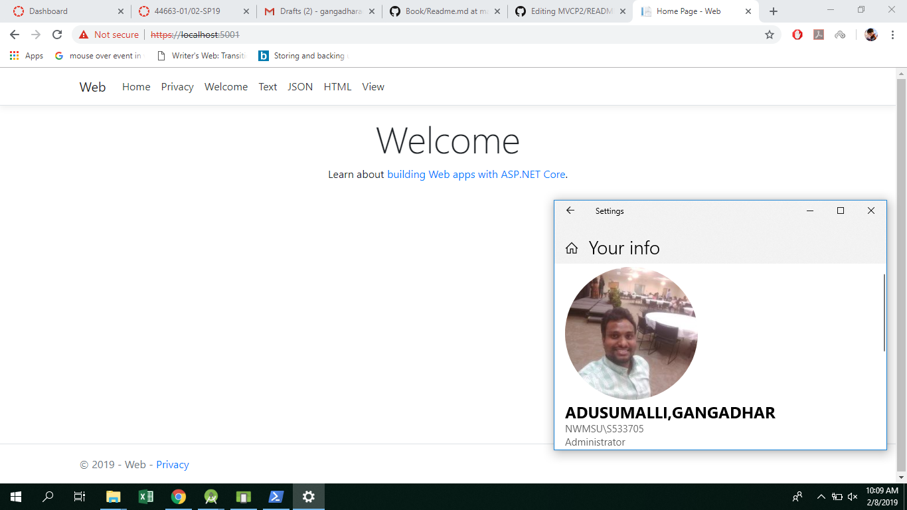

# MVC project

This is a Basic MVC application implements multiple controllers and views which returns JSON, HTML, VIEW and Text.

In Xunit it tests calcSalary method which takes input parameters as wage and hours.

